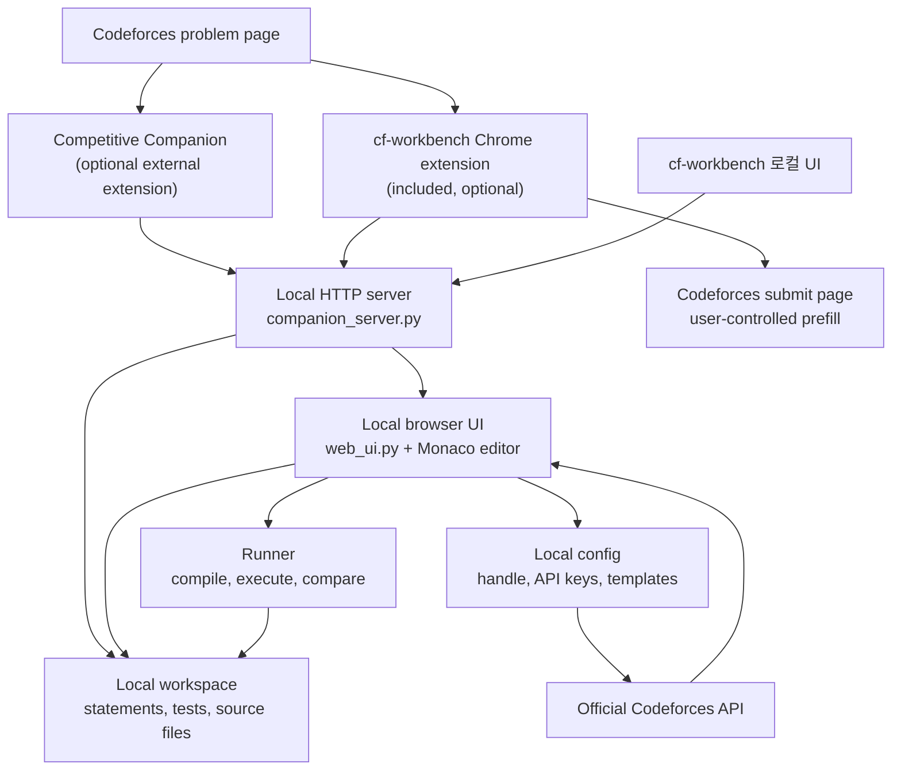
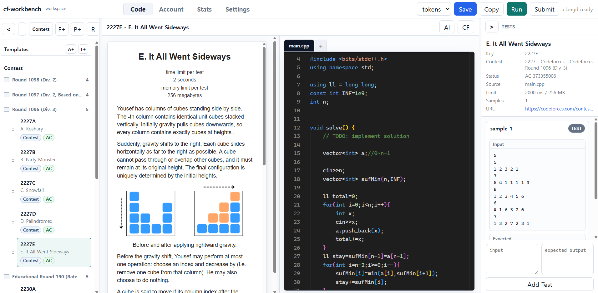
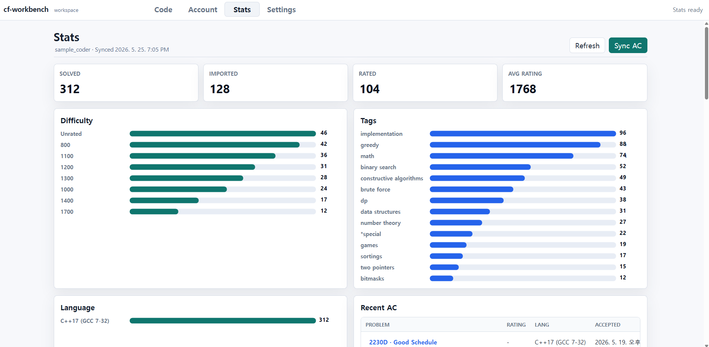

# cf-workbench

**Codeforces 문제 가져오기, 로컬 테스트 실행, 개인 풀이 기록 관리를 위한 로컬 워크벤치입니다.**

[English README](README.md)

`cf-workbench`는 Codeforces 풀이 과정을 로컬 환경에서 관리하기 위한 Python 기반 도구입니다. 문제를 가져오고, C++ 템플릿으로 풀이 파일을 만들고, 샘플/커스텀 테스트를 실행하며, Codeforces 공식 API를 통해 프로필과 제출 정보를 확인할 수 있습니다.

문제 지문, 샘플 테스트, 풀이 코드, 커스텀 테스트, 최근 제출 정보를 한 로컬 작업공간에서 관리하고 싶을 때 사용하면 됩니다.

## 대회 규칙 준수 범위

`cf-workbench`는 의도한 방식으로 사용할 때 Codeforces 대회 규칙을 지키는 범위에서 작동하도록 만든 보조 프로그램입니다. 사용자의 코드, 개인 템플릿, 문제 지문, 샘플 테스트, 로컬 테스트 실행을 관리하는 데 초점을 둡니다. Codeforces 로그인, CAPTCHA, Cloudflare, CSRF, rate limit을 우회하지 않으며, 다른 참가자의 코드를 추출하지 않고, 직접적인 자동 제출도 수행하지 않습니다.

사용자는 항상 공식 [Codeforces Contest Rules](https://codeforces.com/blog/entry/4088?locale=en), [Codeforces Terms](https://codeforces.com/terms), 그리고 각 라운드 공지의 추가 규칙을 따라야 합니다. 개별 대회에서는 기본 규칙이 추가되거나 변경될 수 있습니다.

## 주요 기능

- Competitive Companion payload 또는 포함된 Chrome 확장 프로그램으로 Codeforces 문제 가져오기
- 문제 폴더, 풀이 파일, 템플릿, 샘플 테스트, 커스텀 테스트 로컬 관리
- C++ 풀이 컴파일 및 테스트 실행
- `tokens`, `trim`, `exact` 비교 모드 제공
- Monaco editor 기반 브라우저 로컬 UI 제공
- 웹 UI에서 Codeforces handle과 선택적 API 정보 저장
- Codeforces 프로필, 레이팅 기록, 최근 제출, 맞은 문제 동기화 확인
- 포함된 Chrome 확장 프로그램을 통한 submit 페이지 자동 입력 보조
- Windows에서 `cf-workbench.cmd`로 바로 실행
- 기본 UI는 영어이며, 로컬 `Settings` 탭에서 한국어로 변경 가능

## 사용 흐름

`cf-workbench`는 Codeforces 연습 과정을 다음 흐름으로 정리합니다.

1. 문제를 가져옵니다.
2. 생성된 로컬 풀이 파일을 엽니다.
3. 샘플 테스트를 실행합니다.
4. 필요한 엣지 케이스를 커스텀 테스트로 추가합니다.
5. Codeforces handle을 설정한 경우 최근 제출 또는 맞은 문제 기록을 확인합니다.

작업 파일은 로컬에 저장되며, 기존 풀이 파일을 함부로 덮어쓰지 않고, 생성된 `workspace/` 데이터는 기본적으로 git 업로드 대상에서 제외됩니다.

## 구조와 기능 흐름



## 실행 화면

문제 지문, Monaco editor, 소스 파일, 샘플 테스트를 함께 보는 작업 화면입니다.



가상 샘플 Codeforces 프로필을 사용한 통계 화면입니다.



## 요구 사항

- Python 패키지는 Windows, macOS, Linux에서 실행 가능
- Python 3.11 이상
- C++ 풀이 컴파일을 위한 `g++`
- 포함된 브라우저 확장 프로그램을 사용할 경우 Google Chrome 또는 Chromium 기반 브라우저

## Windows 빠른 시작

다운로드하거나 clone한 저장소에서 `cf-workbench.cmd`를 더블클릭합니다.

터미널을 선호한다면 다음 명령으로 실행할 수도 있습니다.

```powershell
.\cf-workbench.cmd
```

이 명령은 로컬 서버를 시작하고 브라우저 UI를 엽니다. 처음 실행할 때 기본 로컬 설정, `workspace/` 폴더, C++ 템플릿이 없으면 자동으로 생성합니다.

기본 로컬 주소는 다음과 같습니다.

```text
http://127.0.0.1:27121/
```

브라우저가 자동으로 열리지 않으면 위 주소를 직접 입력하면 됩니다.

이후 대부분의 작업은 브라우저 UI 안에서 진행합니다. CLI 명령은 고급 사용이나 개발 작업을 할 때만 필요합니다.

## Codeforces 프로필 설정

웹 UI에서 Codeforces handle을 저장할 수 있습니다.

1. `cf-workbench`를 실행합니다.
2. `Account` 탭을 엽니다.
3. Codeforces handle을 입력합니다.
4. 필요한 경우 Codeforces API 정보를 입력합니다.
5. 계정 설정을 저장합니다.

`Stats` 탭에서 프로필 통계를 새로고침하거나 맞은 제출을 동기화할 수 있습니다.

이 도구는 Codeforces 공식 API endpoint를 사용합니다. Codeforces 비밀번호는 저장하지 않습니다.

## UI 언어 설정

로컬 브라우저 UI는 기본적으로 영어로 시작합니다. 한국어 UI로 바꾸려면 다음 순서로 설정합니다.

1. `cf-workbench`를 실행합니다.
2. `Settings` 탭을 엽니다.
3. `UI language`를 `Korean`으로 선택합니다.
4. 설정을 저장합니다.

이 값은 로컬 `.cfw/config.json`에 저장됩니다.

## 브라우저 확장 프로그램

같은 작업을 위해 여러 확장 프로그램을 동시에 설치할 필요는 없습니다.

| 확장 프로그램 | 필수 여부 | 용도 | 저장소 포함 여부 |
| --- | --- | --- | --- |
| Competitive Companion | 선택 | 표준 payload 형식으로 문제 가져오기 | 미포함, 브라우저 확장 스토어에서 설치 |
| cf-workbench Chrome extension | 선택, submit 페이지 자동 입력에는 필요 | Codeforces 페이지 DOM에서 statement를 캡처하고 로컬 소스 파일로 submit form을 채움 | 포함, `browser-extension/` |

문제 가져오기는 Competitive Companion 또는 포함된 `browser-extension/` 중 하나만 사용해도 됩니다. submit 페이지 자동 입력을 사용하려면 포함된 `browser-extension/`을 Chrome에 로드해야 합니다.

자세한 설정 문서:

- Competitive Companion: `docs/competitive-companion-setup.md`
- 포함된 Chrome 확장: `docs/statement-capture-extension.md`
- submit 페이지 자동 입력: `docs/submit-prefill.md`

## 문제 가져오기

먼저 cf-workbench를 실행하고 브라우저 UI를 열어 둡니다.

Competitive Companion을 사용하는 경우:

1. 브라우저에 Competitive Companion을 설치합니다.
2. Codeforces 문제 페이지를 엽니다.
3. Competitive Companion 버튼을 누릅니다.
4. 로컬 UI에 문제가 추가되었는지 확인합니다.

포함된 Chrome 확장 프로그램을 사용하는 경우:

1. `chrome://extensions`를 엽니다.
2. Developer mode를 켭니다.
3. `browser-extension/` 폴더를 unpacked extension으로 로드합니다.
4. Codeforces 문제 페이지를 엽니다.
5. `cfw` capture 버튼을 사용합니다.
6. 로컬 UI에 문제가 추가되었는지 확인합니다.

가져온 문제는 다음 폴더 아래에 저장됩니다.

```text
workspace/codeforces/
```

## 테스트 실행

`Code` 탭에서 실행합니다.

1. 왼쪽 사이드바에서 문제를 선택합니다.
2. 가운데 editor에서 소스 파일을 작성합니다.
3. 필요한 경우 toolbar에서 비교 모드를 선택합니다: `tokens`, `trim`, `exact`.
4. `Run` 버튼을 눌러 sample test와 custom test를 컴파일/실행합니다.
5. 오른쪽 `TESTS` 패널에서 custom test를 추가합니다.

결과 패널에서 compile error, runtime error, wrong answer, accepted test 결과를 UI 안에서 바로 확인할 수 있습니다.

## 프로젝트 구조

```text
cf-workbench/
|- cfw/                         # 하위 호환 CLI module alias
|- src/cf_workbench/             # 핵심 Python 패키지
|  |- cli.py                     # argparse CLI 진입점
|  |- companion_server.py        # 로컬 HTTP 서버 및 web UI API
|  |- storage.py                 # workspace/problem/test 저장소 관리
|  |- runner.py                  # compile/test 실행
|  |- codeforces_api.py          # Codeforces 공식 API client
|  `- web_ui.py                  # 로컬 브라우저 UI 렌더링
|- browser-extension/            # statement capture/submit prefill Chrome 확장
|- scripts/                      # Windows 실행 helper
|- src/cf_workbench/templates/    # 패키지에 포함된 기본 C++ 시작 템플릿
|- tests/                        # pytest suite
`- workspace/                    # 로컬 생성 작업공간, git 제외
```

## 안전 관련 참고

- Codeforces 로그인, CAPTCHA, Cloudflare, CSRF, rate limit을 우회하지 않습니다.
- 직접적인 자동 제출 POST 요청을 구현하지 않습니다.
- submit 페이지 연동은 사용자가 직접 확인하고 실행하는 보조 기능입니다.
- 가져온 workspace, 생성된 binary, log, 로컬 credential은 git 업로드 대상에서 제외됩니다.
