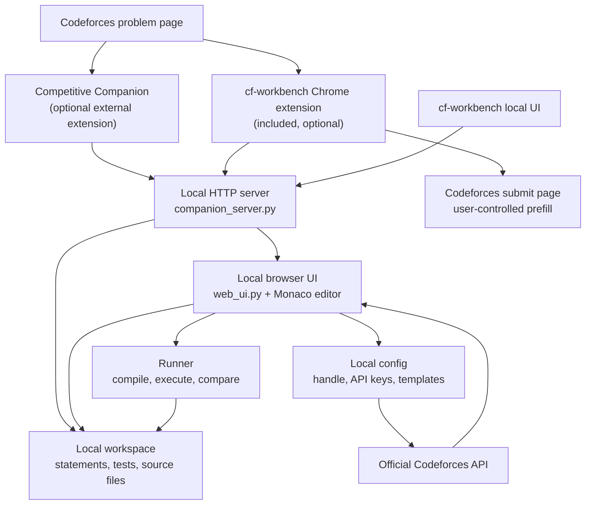

# cf-workbench

**Local Codeforces practice workbench for importing problems, running tests, and tracking personal progress.**

[한국어 README](README.ko.md)

`cf-workbench` is a local-first programming practice tool for Codeforces. It imports problems, creates C++ solution files from local templates, runs sample and custom tests, and can show Codeforces profile/submission information through the official Codeforces API.

Use it when you want one local workspace for problem statements, sample tests, source files, custom test cases, and recent submission context.

## Contest Rule Scope

`cf-workbench` is designed as an assistive program that operates within Codeforces contest-rule boundaries when used as intended. It helps you manage your own code, personal templates, problem statements, sample tests, and local test runs. It does not bypass Codeforces login, CAPTCHA, Cloudflare, CSRF, or rate limits; it does not extract other contestants' code; and it does not perform direct automated submissions.

Always follow the official [Codeforces Contest Rules](https://codeforces.com/blog/entry/4088?locale=en), [Codeforces Terms](https://codeforces.com/terms), and any round-specific announcements, because individual contests may add or modify rules.

## Highlights

- Import Codeforces problems from Competitive Companion payloads or the included Chrome extension
- Manage problem folders, source files, templates, sample tests, and custom tests locally
- Compile and run C++ solutions with configurable comparison modes: `tokens`, `trim`, `exact`
- Use a browser-based local UI with Monaco editor integration
- Save a Codeforces handle and optional API credentials from the web UI
- View Codeforces profile information, rating history, recent submissions, and accepted-problem sync
- Optionally prefill Codeforces submit pages through the included Chrome extension
- Run from a downloaded repository on Windows with `cf-workbench.cmd`
- English UI by default, with Korean available from the local Settings tab

## What You Can Do

`cf-workbench` keeps the usual Codeforces practice loop in one place:

1. Import a problem.
2. Open the generated local solution file.
3. Run the sample tests.
4. Add edge cases as custom tests.
5. Check recent submissions or sync accepted problems when a Codeforces handle is configured.

The project stores its working files locally, avoids overwriting existing solutions, and keeps generated workspace data out of git by default.

## Structure And Workflow



## Screenshots

Problem workspace with statement view, Monaco editor, source files, and sample tests:


Stats dashboard with a fictional sample Codeforces profile:


## Requirements

- Windows, macOS, or Linux for the Python package
- Python 3.11+
- `g++` for compiling C++ solutions
- Google Chrome or a Chromium-based browser if you want to use the included browser extension

## Quick Start On Windows

From a downloaded or cloned repository, double-click `cf-workbench.cmd`.

If you prefer a terminal, run:

```powershell
.\cf-workbench.cmd
```

This starts the local server and opens the browser UI. On first run, it creates the default local config, workspace folder, and C++ template if they do not already exist.

The default local address is:

```text
http://127.0.0.1:27121/
```

If the browser does not open automatically, copy that address into your browser.

Most day-to-day work happens inside the browser UI after this step. CLI commands
are only needed for advanced or development workflows.

## Codeforces Profile

You can save a Codeforces handle from the web UI:

1. Start `cf-workbench`.
2. Open the `Account` tab.
3. Enter your Codeforces handle.
4. Optionally enter Codeforces API credentials.
5. Save the account settings.

Open the `Stats` tab to refresh profile statistics or sync accepted submissions.

The tool uses official Codeforces API endpoints. It does not store Codeforces passwords.

## UI Language

The local browser UI starts in English by default. To switch the UI to Korean:

1. Start `cf-workbench`.
2. Open the `Settings` tab.
3. Set `UI language` to `Korean`.
4. Save settings.

The preference is stored in your local `.cfw/config.json`.

## Browser Extensions

You do not need multiple extensions for the same task.

| Extension | Required? | Purpose | Included in this repo? |
| --- | --- | --- | --- |
| Competitive Companion | Optional | Import problems through its standard payload format | No, install from the browser extension store |
| cf-workbench Chrome extension | Optional, but needed for submit prefill | Capture Codeforces statements from the page DOM and fill submit forms from local source files | Yes, `browser-extension/` |

For problem import, use either Competitive Companion or the included `browser-extension/`. For submit prefill, load the included `browser-extension/`.

Detailed setup:

- Competitive Companion: `docs/competitive-companion-setup.md`
- Included Chrome extension: `docs/statement-capture-extension.md`
- Submit prefill: `docs/submit-prefill.md`

## Problem Import

Start cf-workbench first, then keep the browser UI open.

With Competitive Companion:

1. Install Competitive Companion in your browser.
2. Open a Codeforces problem page.
3. Click the Competitive Companion button.
4. Confirm that the problem appears in the local UI.

With the included Chrome extension:

1. Open `chrome://extensions`.
2. Enable Developer mode.
3. Load the `browser-extension/` folder as an unpacked extension.
4. Open a Codeforces problem page.
5. Use the `cfw` capture button.
6. Confirm that the problem appears in the local UI.

Imported problems are stored under:

```text
workspace/codeforces/
```

## Running Tests

Use the `Code` tab:

1. Select a problem from the left sidebar.
2. Edit the source file in the center editor.
3. Choose the comparison mode from the toolbar if needed: `tokens`, `trim`, or `exact`.
4. Click `Run` to compile and run the sample and custom tests.
5. Add custom tests from the `TESTS` panel on the right.

The result panel shows compile errors, runtime errors, wrong answers, and accepted
test results without leaving the UI.

## Project Layout

```text
cf-workbench/
|- cfw/                         # Backward-compatible CLI module alias
|- src/cf_workbench/             # Main Python package
|  |- cli.py                     # argparse CLI entry point
|  |- companion_server.py        # Local HTTP server and web UI API
|  |- storage.py                 # Workspace/problem/test persistence
|  |- runner.py                  # Compile and test execution
|  |- codeforces_api.py          # Official Codeforces API client
|  `- web_ui.py                  # Rendered local browser UI
|- browser-extension/            # Chrome extension for statement capture/prefill
|- scripts/                      # Windows launch helpers
|- src/cf_workbench/templates/    # Packaged default C++ starter template
|- tests/                        # pytest suite
`- workspace/                    # Local generated workspace, ignored by git
```

## Safety Notes

- The project does not bypass Codeforces login, CAPTCHA, Cloudflare, CSRF, or rate limits.
- It does not implement direct automated submission POST requests.
- Submit-page integration is explicit and user-controlled.
- Imported workspaces, generated binaries, logs, and local credentials are excluded from git.
